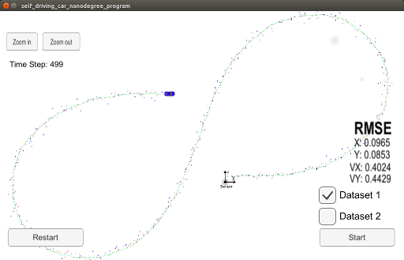

# Extended Kalman Filter Project
### Self-Driving Car Engineer Nanodegree Program
# 
#

In this project we utilize a kalman filter to estimate the state of a moving object of interest with noisy lidar and radar measurements. 

This project involves the Term 2 Simulator which can be downloaded [here](https://github.com/udacity/self-driving-car-sim/releases)

This project requires uWebSocketIO library. Once the install for uWebSocketIO is complete, the main program can be built and run by doing the following from the project top directory.

1. mkdir build
2. cd build
3. cmake ..
4. make
5. ./ExtendedKF

## Other Important Dependencies

* cmake >= 3.5
  * All OSes: [click here for installation instructions](https://cmake.org/install/)
* make >= 4.1 (Linux, Mac), 3.81 (Windows)
  * Linux: make is installed by default on most Linux distros
  * Mac: [install Xcode command line tools to get make](https://developer.apple.com/xcode/features/)
  * Windows: [Click here for installation instructions](http://gnuwin32.sourceforge.net/packages/make.htm)
* gcc/g++ >= 5.4
  * Linux: gcc / g++ is installed by default on most Linux distros
  * Mac: same deal as make - [install Xcode command line tools](https://developer.apple.com/xcode/features/)
  * Windows: recommend using [MinGW](http://www.mingw.org/)

## Basic Build Instructions

1. Clone this repo.
2. Make a build directory: `mkdir build && cd build`
3. Compile: `cmake .. && make` 
   * On windows, you may need to run: `cmake .. -G "Unix Makefiles" && make`
4. Run it: `./ExtendedKF `

## Code Style

Please (do your best to) stick to [Google's C++ style guide](https://google.github.io/styleguide/cppguide.html).

I hate the google style , it's not logical or pretty, but sometimes you have to conform to the crowd.

## Changes Made

Briefly, I refactored the given source code slightly. Modified the main.cpp file , to allow it to recognize two command line arguments /noradar and /nolidar - so we can see the difference of just using one sensor - it effectly stops the radar/lidar measurements being passed to ProcessMesaurement.

The fusionEKF.cpp file has been changed slightly, and most of the work is done in the KalmanFilter class. The current state vector is intialized on first measurement, otherwise the timestamp difference between the previous values is calcualted , this is now passed to the kalman_filter Predict method - as dt can be used to create the F_ and Q_ matrix.

The fusionEKF.cpp calls updateRADAR or updateLIDAR appropriately . The method  updateLIDAR uses the regular kalman filter. The  updateRADAR uses the extended version , by converting the current state to polar - so the difference between measurements can be taken, It also creates the H_radar_ jacobian matrix.

The residual vector y, has its phi angle constrained to the [ -pi,+pi ] range as it should be .. , 

The initial estimate of the vector components vx,vy on the first measurement seem to help the final RMSE values to some extent. So starting these at 1,1 seems to work well. Also using a smaller value for the object covariance matrix P_ of 225 instead of 1000 also improves stability.

## Results

### Dataset - 1 :ff Results
# 
                                             
|   .	| Radar Only 	| Lidar Only  	|  Radar + Lidar 	|
|------	|-----	|-----	|-----	|
|  x 	| 0.1915 | 0.1222  	|   0.0965	|
|  y 	| 0.2798 | 0.0984  	|   0.0853	|
|  vx 	| 0.5232 | 0.5280	|   0.4024  |   	
|  vy 	| 0.6642 | 0.4581  	|   0.4429	|

